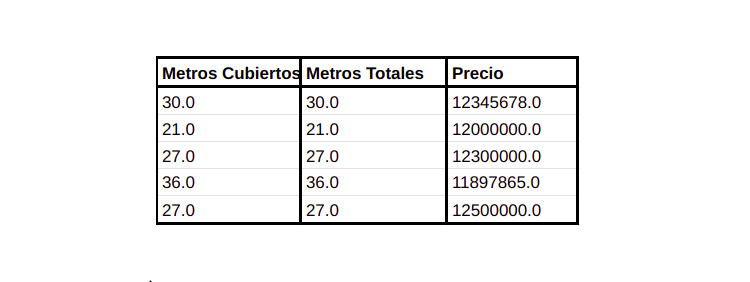
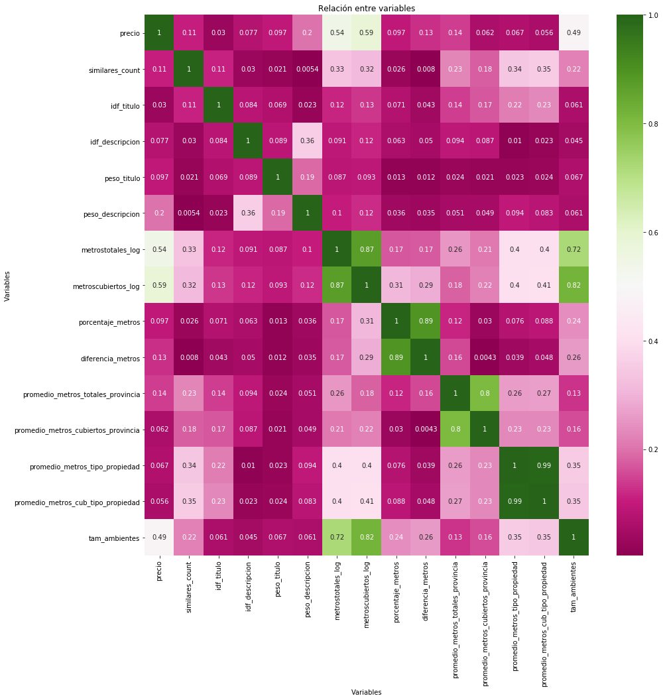
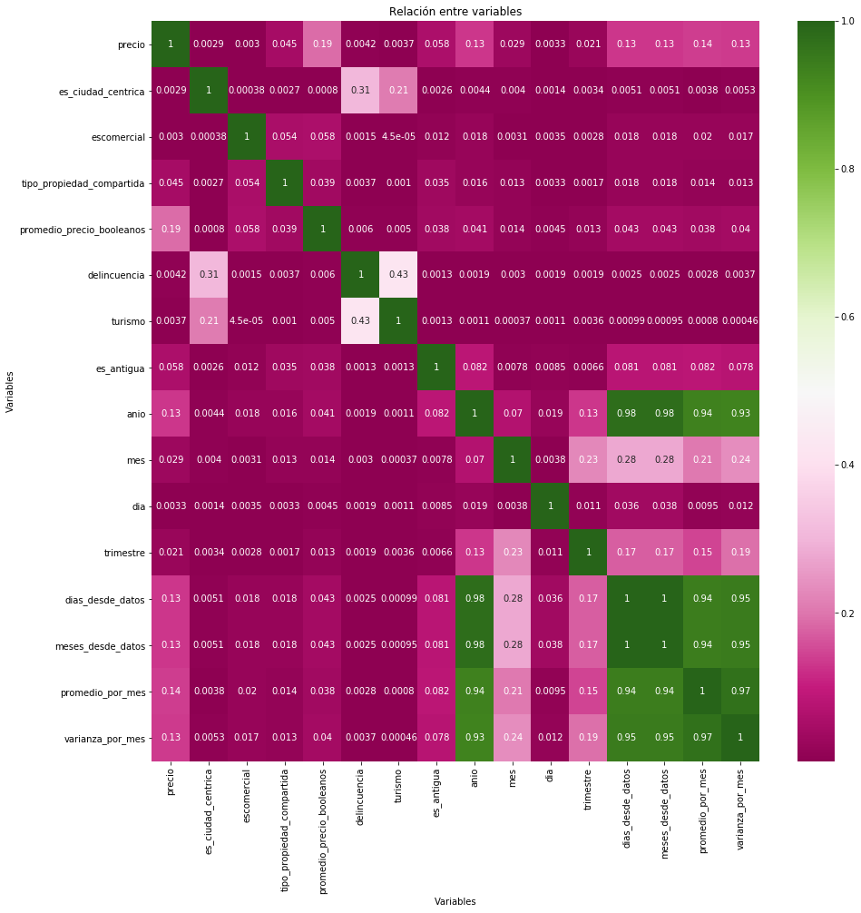
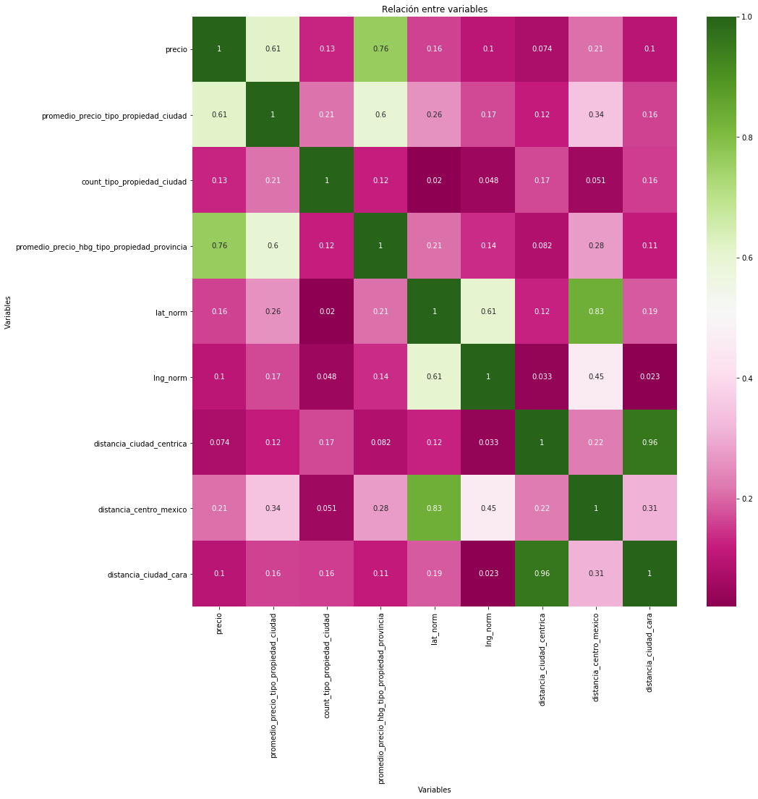
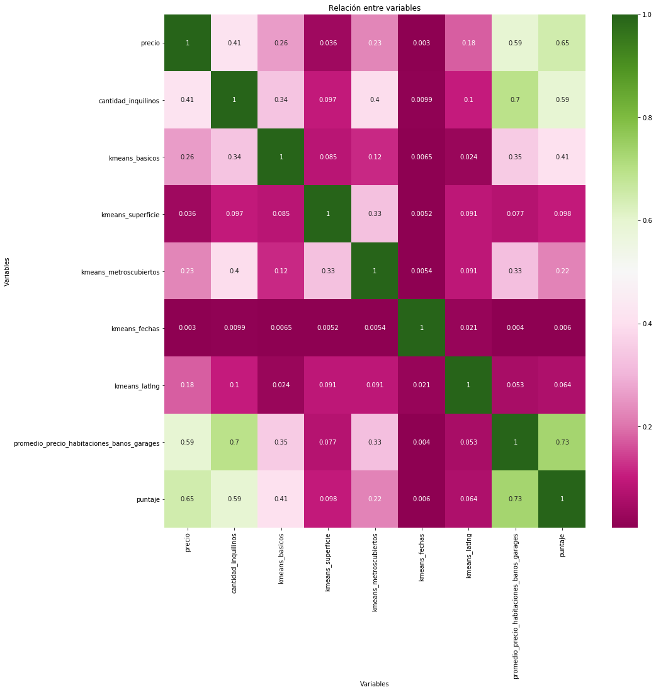
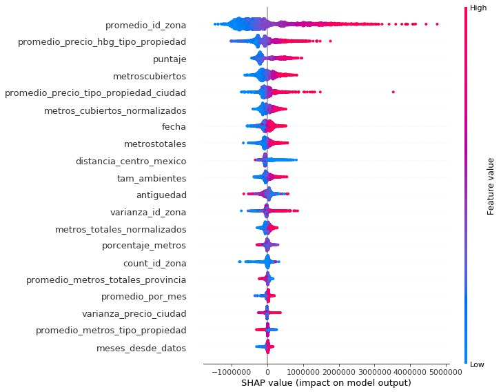
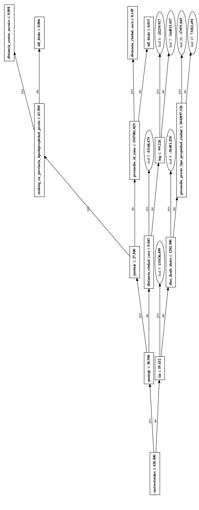
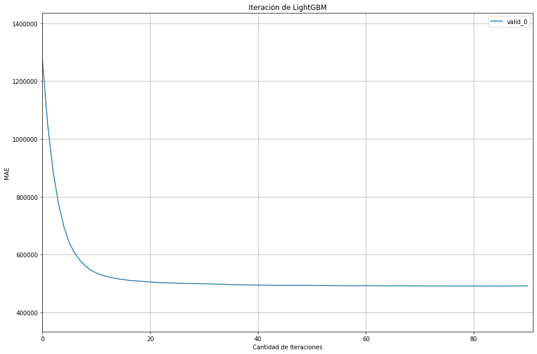
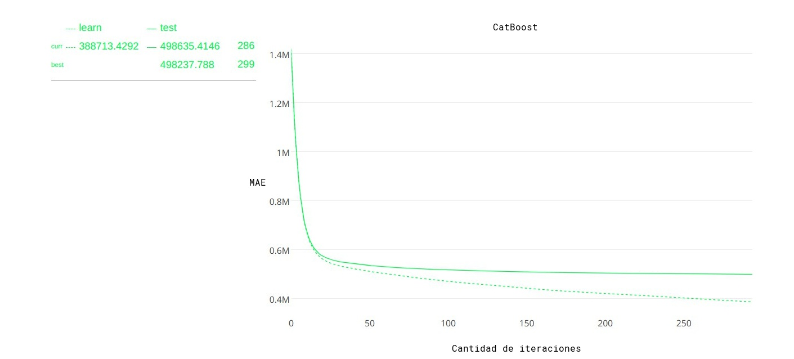

 
# Trabajo Práctico 2: Machine Learning

## Índice

- [Trabajo Práctico 2: Machine Learning](#trabajo-pr%c3%a1ctico-2-machine-learning)
  - [Índice](#%c3%8dndice)
  - [Introducción](#introducci%c3%b3n)
    - [Nulos](#nulos)
    - [PCA](#pca)
    - [Filtrado](#filtrado)
    - [Dolarizar](#dolarizar)
  - [Features](#features)
    - [Feature engineering](#feature-engineering)
      - [Independientes del precio](#independientes-del-precio)
      - [Dependientes del precio](#dependientes-del-precio)
      - [En relación a los textos](#en-relaci%c3%b3n-a-los-textos)
      - [Distancias](#distancias)
      - [One Hot Encoding](#one-hot-encoding)
      - [KD trees](#kd-trees)
      - [Rankings](#rankings)
      - [Intervalos](#intervalos)
      - [Clustering](#clustering)
    - [Feature Selection](#feature-selection)
      - [SelectKBest](#selectkbest)
      - [SelectFromModel](#selectfrommodel)
      - [Recursive Feature Elimination (RFE)](#recursive-feature-elimination-rfe)
      - [Recursive Feature Elimination w/ Cross Validation (RFECV)](#recursive-feature-elimination-w-cross-validation-rfecv)
      - [Shap](#shap)
  - [Parameter tuning](#parameter-tuning)
    - [Hyperopt](#hyperopt)
    - [Random Search](#random-search)
    - [Grid Search](#grid-search)
  - [Modelos](#modelos)
    - [XGBoost](#xgboost)
    - [LightGBM](#lightgbm)
    - [Catboosting](#catboosting)
    - [Random Forest](#random-forest)
    - [Extra Randomized Tree](#extra-randomized-tree)
    - [Redes neuronales](#redes-neuronales)
      - [Keras](#keras)
  - [Ensambles](#ensambles)
    - [Stacking](#stacking)
    - [Blending](#blending)
  - [Conclusiones](#conclusiones)

## Introducción

El objetivo principal del trabajo es determinar, para cada propiedad presentada, cuál es su valor de mercado.
La puesta en marcha de la actividad se hace con algoritmos de Machine Learning, una disciplina que busca poder generar clasificaciones en base a un entrenamiento previo sobre información pasada, seguida de una validación de las predicciones generadas. En el trabajo práctico se prueban distintos algoritmos, los cuales todos en distinta manera hacen uso de los datos. Es por esto que es muy importante saber qué datos usar, y buscar cómo codificarlos de tal forma que mejor se aprovechen.

El primer paso consistió en realizar una breve investigación sobre lo ya hecho en el anterior trabajo práctico, donde se realizó un análisis exploratorio de datos brindados por Zona Prop. Si bien no son exactamente los mismos datos que los trabajados acá, sí son de la misma índole.

### Nulos

Algunos algoritmos admiten datos incompletos y otros no. En los casos en los que los datos incompletos no son admisibles, debemos solucionarlos de alguna forma.

El proceso de imputación de valores faltantes puede hacerse de muchas formas, una forma muy simple es completar con el valor promedio para atributos numéricos y con el valor más popular para atributos categóricos. Esto se realiza tanto con las habitaciones, garages, baños y antigüedad.

Como caso particular, se observó que figuraban propiedades con valor nulo en su columna: Metros Totales, pero ninguna de ellas presentaban nulos en Metros cubiertos (o viceversa). Por lo que se decidió completar los nulos con el dato no faltante de este par de columnas. Esta idea surge a partir del análisis realizado en el primer Trabajo práctico, donde se encuentra cierta relación entre los metros según el tipo de propiedad.

Se completan las latitudes y longitudes faltantes con un promedio de estas features para aquellas propiedades que comparten id_zona, y en su defecto ciudad, y en el caso de no contar con ninguno de estos datos, con el promedio para las propiedades que comparten provincia. Verificando siempre que el promedio se encuentre dentro del mapa.

### PCA

Se utilizó PCA en un intento de manipular la dimensionalidad de los datos. La idea de PCA es encontrar las ”direcciones” principales de los datos, es decir, aquellas direcciones sobre las cuales podemos proyectar los datos reteniendo su variabilidad.
Sin embargo, en el afán de reducir el ruido del set de datos, los resultados no fueron buenos ya que _overfiteaban_.

### Filtrado

La detección de anomalías (outliers) implica el reconocimiento y corrección o eliminación de datos erróneos. Un dato anómalo es aquel que tiene valores imposibles para uno, o más, de sus atributos. Por lo que en una primera instancia se decide, filtrar aquellos registros que semánticamente son posible pero no tiene sentido en el contexto de los demás datos, es decir que probablemente se trate de un dato mal ingresado. Para encontrarlos con facilidad, utilizamos PCA para reducir las dimensiones y poder graficarlos.
En las Figuras 1-4 se pueden observar los recortes realizados.

Los datos en la figura 1 representa la reducción de dimensiones considerando todas las columnas del set de datos original, excluyendo al precio. Observando los datos de los outliers en las parte superior e inferior, estos tienen mucha diferencia entre los metroscubiertos y los metrostotales. Filtrando las 800 propiedades con mayor diferencia entre metros cubiertos y totales se obtiene un nuevo dataset plasmado en la Figura 2.

Teniendo en cuenta los precios de las propiedades, los outliers de la Figura 3 tienen un precio muy elevado en relacion a los metroscubiertos y metrostotales. A modo de ejemplo, se muestran cinco casos en donde es notoria la anomalía:

Nuevamente son filtrados estos casos dejando un set de datos con menos ruido como se puede observar en la Figura 4.

### Dolarizar

En el primer trabajo práctico, con el fin de que el lector tenga una noción más globalizada del precio de las propiedades, se optó por dolarizar dichos valores, teniendo en cuenta la fecha de publicación. Para poder realizar esta tarea, se procedió a usar una API gratuita del Banco Central de Europa [^1]. Está integración permitió obtener la cotización del Dólar en pesos Mexicanos para cada una de las fechas existentes en el set de datos. Como resultado de este proceso, se obtuvo para cada una de las 239732 propiedades, el valor de su precio en dólares, acorde a la ubicación temporal en la que fue publicado. Este proceso se repitiió nuevamete en busca de mejores resultados, pero en general se obtuvo lo mismo o incluso peor. Por ende esta idea fue rápidamente descartada.

## Features

### Feature engineering

Con lo investigado del trabajo práctico anterior y todos los dataframes generados, se busca todo tipo de atributos de los usuarios, para que luego puedan ser seleccionados y aprovechados por los algoritmos aplicados.

Primero se separan las features según su dependencia con el precio de la propiedad:

#### Independientes del precio

- **Metros Totales y Cubiertos**

  - *metrostotales_log, metroscubiertos_log*: Escala logarítmica de los metros totales y cubiertos.
  - *porcentaje_metros*: Metros cubiertos sobre metros totales.
  - *diferencia_metros*: La diferencia entre los metros totales y cubiertos.
  - *intervalo_metros_totales, intervalo_metros_cubiertos*: Se agrupan en 5 intervalos dependiendo del tamaño de la propiedad.
  - *metros_totales_normalizados, metros_cubiertos_normalizados*: Los metros totales y cubiertos normalizados.

- **Por tipo de propiedad**

  - *escomercial*: Booleano que indica si la propiedad es del tipo comercial(Bodega comercial, centro comercial, etc.) o no(Casa, apartamento, etc.).
  - *tipo_propiedad_compartida*:  Booleano que indica si la propiedad es compartida(Casa en condominio, Duplex, etc.) o no(Casa, apartamento, etc.).
  - *promedio_metros_tipo_propiedad, promedio_metros_cub_tipo_propiedad*: el promedio de metros que tiene cada tipo de propiedad.
  - *prop_frecuente*: Aquellas propiedades que aparecen en el mercado mayor cantidad de veces.

- **Por ubicación**

  - *zona*: División del mapa por Norte, Centro o Sur.
  - *top_provincia*: Ranking de provincias ordenadas de las más caras a las menos(No depende del precio especificamente, solo se basa en los datos encontrados en el primer trabajo práctico).
  - *es_ciudad_centrica*: Booleano que indica si la ciudad es la más poblada de la provincia(Ej: en Distrito Federal, Benito Juárez).
  - *promedio_metros_totales_provincia, promedio_metros_cubiertos_provincia*: el promedio de metros que tiene cada provincia.

- **Por fecha**

  - *anio,mes,dia*: Separó del feature fecha en día, mes y año.
  - *trimestre*: Indicó en qué trimestre del año pertenece la propiedad.
  - *dias_desde_datos, meses_desde_datos*: Distancias entre las diferentes publicaciones.

- **Propiedades booleanas**

  - *escuelas_centros_cercanos*: Verifica si tiene escuelas cercanas, centros comerciales cercanos, ambos o ninguno.
  - *delincuencia*: Booleano indicando si es una ciudad con alta tasa de delincuencia.
  - *turismo*: Booleano indicando si es una ciudad considerada turística.
  - *es_lujoso*: Booleano que determina si una propiedad es lujosa o no, esto se verifica si la propiedad cuenta con piscina, usos múltiples y gimnasio.
  - *es_capital*: Booleano que indica si es la capital federal del país o no lo es.

- **Por cantidad de habitaciones, garages y baños**

  - *cantidad_inquilinos*: Promedio aproximado de personas que viven en la propiedad según la cantidad de  habitaciones, garages y baños.
  - *tam_ambientes*: Los metros cubiertos dividido la cantidad de habitaciones y baños.

- **Antigüedad**

  - *es_antigua*: Booleano que indica si la propiedad tiene más de 30 de antigüedad, indicando si es o no antigua.
  - *habitaciones_antiguedad*: El promedio de habitaciones según la cantidad de años de la propiedad.

#### Dependientes del precio

- **Por ubicación**

  - *promedio_precio_provincia, promedio_provincia_log*: Se agrupa por provincia y se calcula el promedio del precio de cada una. Se genera un feature con el promedio normal y otro con una escala logarítmica.
  - *promedio_precio_ciudad, promedio_ciudad_log*: Idem para cada una de las ciudades de México.
  - *promedio_precio_ciudad_gen*: Se generaliza el feature.
  - *varianza_precio_ciudad*: Se agrupa por ciudades y se calcula la varianza del precio.
  - *count_ciudad*: Se agrupa por ciudades y se calcula la cantidad de propiedades que hay en esta.
  - *promedio_id_zona, promedio_id_zona_log, promedio_id_zona_gen, varianza_id_zona count_id_zona*: Idem provincia y ciudades.

- **Por tipo de propiedad**

  - *promedio_precio_tipo_propiedad*: Se agrupa por tipo de propiedad y se asigna el promedio del precio.
  - *promedio_precio_tipo_propiedad_ciudad,  promedio_precio_tipo_propiedad_ciudad_gen*: Se agrupa tanto por el tipo de propiedad como por la ciudad a la que pertenece y se le asigna el precio promedio.
  - *count_tipo_propiedad*: Se agrupa por tipo de propiedad y se calcula la cantidad de propiedades de ese mismo tipo existen en los datos.
  - *count_tipo_propiedad_ciudad*:  Se agrupa por tipo de propiedad y ciudad, a continuación se calcula la cantidad de propiedades de ese mismo tipo existentes en cada ciudad.

- **Por fecha**

  - *promedio_por_mes*: Se calcula el promedio de precios por cada mes del año.
  - *varianza_por_mes*:  Se calcula la varianza de precios por cada mes del año.

- **Por cantidad de habitaciones, garages y baños**

  - *promedio_precio_habitaciones*: Se agrupa por cantidad de habitaciones y se calcula el precio promedio.
  - *promedio_precio_banos_garages*: Idem pero se agrupa por cantidad de baños y garages.
  - *promedio_precio_habitaciones_banos_garages*: Idem pero se agrupa por cantidad de habitaciones, garages y baños.
  - *promedio_precio_hbg_tipo_propiedad*: Idem pero se agrupa también por tipo de propiedad.
  - *promedio_precio_hbg_tipo_propiedad_provincia*: Idem pero también se agrupa por provincia.
  - *promedio_precio_hbg_tipo_propiedad_provincia_gen*: Se generalizó el último feature.

- **Por propiedades booleanas**

  - *promedio_precio_booleanos*: Se agrupa por las propiedades booleanas(si tiene o no piscina, gimnasio y usos múltiples) y se calcula el precio promedio.

- **Por puntajes(Insight)**

  - *puntaje*: A partir de lo aprendido en el Trabajo Práctico I, se realizó un importante aporte a Navent donde calificamos cada una de las propiedades con el objetivo de poder encontrar el 'precio ideal' para todas las publicaciones. Por ende teniendo en cuenta: la piscina, gimnasio, usos multiples, cantidad de baños, habitaciones, garages, metros totales, cubiertos y provincia se van a puntuar las propiedades.

#### En relación a los textos

- *idf_titulo, idf_descripcion*: La idea de TF-IDF es darle a cada término un peso que sea inversamente proporcional a su frecuencia. Los términos que aparecen en muchas propiedades serán entonces menos importantes que los términos que solo aparecen en unos pocos. El IDF de un término se calcula de la forma: $IDF(t_i) = log(\frac{N + 1}{f_(t_i))}$ Donde N es la cantidad de documentos y $f_(t_i)$ es la cantidad de registros en los que aparece el término. Mientras que TF es el term frequency. Se calculan tanto para el título, como para la descripción de cada propiedad.
- *peso_titulo, peso_descripcion*: Un contador de palabras importantes en el título y la descripción.

#### Distancias

- *distancia_ciudad_centrica*: Con la distancia Euclidiana se encuentra la distancia entre la propiedad y la ciudad más importante de la Provincia.

- *distancia_centro_mexico*: Con la distancia Euclidiana se encuentra la distancia entre la propiedad y el centro de México: Distrito Federal.

- *distancia_ciudad_costosa*: A partir de las ciudades con mayores promedios en precio de cada provincia, se calcula la distancia entre cada propiedad y la misma.

#### One Hot Encoding

Consiste en dividir el atributo en tantas columnas como valores posibles puede tener y usar cada columna como un dato binario indicando si el atributo toma o no dicho valor. Por lo que esta idea se repite para todos los features categóricos: provincia, tipodepropiedad, zona, etc.

#### KD trees

Sklearn nos provee de _neighbors_, funcionalidad que resuelve el problema de los vecinos más cercanos.
Este algoritmo consiste en encontrar los vecinos más cercanos del punto a clasificar, y luego simplemente predecir que el punto en cuestión será de la clase predominante entre sus vecinos.
Se elige este algoritmo debido a que un enfoque en fuerza bruta cuenta con una complejidad algorítmica muy alta, KD Tree trabaja con una estructura muy eficiente ya que si el punto A es lejano del punto B y B es cercano a C, entonces logra darse cuenta que A y C son puntos lejanos sin tener que calcular sus distancias.
 
#### Rankings

Siguiendo la idea del Insight realizada en el Trabajo Práctico I, se realizaron diferentes rankings según las características de la propiedad:

- *ranking_en_provincia, ranking_en_ciudad*: Organiza las provincias dejando como primer puesto a aquella provincia/ciudad con precio más elevado.
- *ranking_en_provincia_tipodepropiedad_precio,* *ranking_en_provincia_tipodepropiedad_cantidad,*
*ranking_en_provincia_ciudad_precio,* *ranking_en_provincia_ciudad_cantidad*: El ranking se basa en dos atributos, va a depender de su provincia y del tipo de propiedad, o de la provincia y la ciudad. Además se realizan dos tipos de ranking: uno basado en sus precios y el otro en 'popularidad', es decir la cantidad de propiedades que cuentan con esas características.
- *ranking_en_provincia_intervalo_metros_totales_precio ,  ranking_en_provincia_intervalo_metros_totales_cantidad ,
ranking_en_provincia_intervalo_metros_cubiertos_precio ,  ranking_en_provincia_intervalo_metros_cubiertos_cantidad ,  ranking_en_tipodepropiedad_intervalo_metros_totales_precio ,  
ranking_en_tipodepropiedad_intervalo_metros_totales_cantidad ,
ranking_en_tipodepropiedad_intervalo_metros_cubiertos_precio,
ranking_en_tipodepropiedad_intervalo_metros_cubiertos_cantidad*: En una primera instancia se generan intervalos (en cuanto a los percentiles) tanto para los metros totales, como los cubiertos. Una vez separados según su tamaño, estos son agrupados por provincia y por tipo de propiedad, generando un ranking que dependa de ambos atributos.
- *ranking_en_provincia_intervalo_distancia_ciudad_cara_precio,  ranking_en_provincia_intervalo_distancia_ciudad_cara_cantidad*: Nuevamente es necesario generar intervalos entre todas las distancias encontradas a partir de los percentiles. Se toman esos intervalos y se agrupan junto con la provincia perteneciente a cada uno de las propiedades y con ello generar el ranking.

#### Intervalos

A continuación se enumeran los nuevos features que fueron divididos tanto por intervalos **uniformes**, como por intervalos que dependen de sus **percentiles**. Se cuenta con una función que permite generar n intervalos según la conveniencia. Para el trabajo, se eligieron 12 intervalos para cada feature, ya que con un número más elevado podríamos correr el riesgo de overfitear los resultados.

- *antiguedad_bins_unif, antiguedad_bins_perc*
- *ditancia_centro_bins_unif, ditancia_centro_bins_perc*
- *distancia_centro_mexico_bins_unif , distancia_centro_mexico_bins_perc*
- *distancia_ciudad_cara_bins_unif , distancia_ciudad_cara_bins_perc*
- *promedio_id_zona_bins_unif, promedio_id_zona_bins_perc*
- *promedio_precio_hbg_tipo_propiedad_provincia_bins_unif ,  promedio_precio_hbg_tipo_propiedad_provincia_bins_perc*
- *promedio_precio_tipo_propiedad_ciudad_bins_unif ,  promedio_precio_tipo_propiedad_ciudad_bins_perc*
- *promedio_precio_hbg_tipo_propiedad_provincia_bins_unif ,   promedio_precio_hbg_tipo_propiedad_provincia_bins_perc*
- *tam_ambientes_bins_unif, tam_ambientes_bins_perc*
- *metrostotales_bins_unif, metrostotales_bins_perc*
- *metroscubiertos_bins_unif, metroscubiertos_bins_perc*

#### Clustering

Clustering es una técnica de entrenamiento no supervisado, es decir que se va a trabajar con las propiedades del DataFrame, sin tener un tipo de salida esperado. La idea principal es agrupar aquellos ítems similares dentro del mismo grupo. Especificamente, en este trabajo práctico se realizaron varias asociaciones de datos, teniendo en cuenta distintos conjuntos de features para cada una de ellas. 
En particular, se utilizó *kmeans* como método de agrupamiento, el cual tiene como principal hiperparámetro la cantidad de clusters entre los cuales se pretende dividir la información. Como en el resto del trabajo, elegir buenos hiperparámetros es esencial para maximizar los resultados de las predicciones, no obstante, se procedió a graficar en cada caso el score vs la cantidad de clusters. A modo de ejemplo, a continuación se muestra el esquema correspondiente a los features: *metrostotales*, *metroscubiertos*, *metrostotales_log*, *metroscubiertos_log*, *porcentaje_metros*, *diferencia_metros*, *intervalo_metros_totales*, 
*intervalo_metros_cubiertos*, *metroscubiertos_bins_unif* y *metroscubiertos_bins_perc* y su respectivo puntaje variando la cantidad de agrupaciones.

Dado el gráfico(Figura 5) se puede observar que a partir de *6* clusters empieza a ser menos relevante el score que se pierde comparado con lo ganado previamente. De esta manera se determinó el número de clusters con los cuales trabajar para los mencionados features. 
Con fin de obtener una representación visual de como quedaron separadas las propiedades, y a modo de ejemplo, en la Figura 6 se muestra la proyección en dos dimensiones de las columnas: *metros totales* y *metros cubiertos*, donde el color de cada punto indica a que cluster pertenece.

El label asociado a cada cluster es lo que se usará a modo de feature en los algoritmos de regresión.

Como conclusión de los features encontrados se presenta un mapa de correlación con algunos de los features que presentan mayor relación con el precio (Figuras 7-10), es la misma idea presentada en el primer trabajo enlazado con lo aprendido hasta el momento. Como se puede observar, no todos los features cuentan con el mismo _peso_, se podría decir que algunos son más importantes que otros a la hora de predecir los precios de las propiedades. Es por eso que en la siguiente sección nos concentramos en la selección de los mismos con el fin de entrenar los modelos solamente con los mejores. Se excluyen varios features y se separa en 4 gráficos debido a la alta cantidad de features, y para facilitar la lectura de los resultados, siempre mostrando una comparación con el precio para poder apreciar principalmente si el feature tiene una fuerte o débil relación con el mismo.
 

 

 

 

 
### Feature Selection
 
Una vez que se tienen todos los atributos en un mismo dataframe  se pudo observar que no siempre hay que entrenar los modelos con la totalidad de features del dataframe. Viendo que para algunos algoritmos el orden y la selección de los features lograba distintos resultados, se busca la forma de encontrar la combinación óptima de features y eliminar todo el ruido posible.
 
#### SelectKBest
 
Elige los mejores features tomando los k que cuenten con mayor correlación con el precio.
 
#### SelectFromModel
 
Este método es muy similar a SelectKBest, entrena un modelo y devuelve los k features con mayor relevancia, pero aquí se va a condicionar por el puntaje que le dio el modelo. Es importante que el modelo tiene que ser compatible con la API de sklearn.
 
#### Recursive Feature Elimination (RFE)
 
RFE fue la herramienta que nos dejó los mejores resultados. Se trata de un método que va eliminando aquellos features que sean débiles hasta quedarse con la cantidad establecida. Para ello, rankea todos los features y a través de una eliminación recursiva obtiene el resultado final.
 
#### Recursive Feature Elimination w/ Cross Validation (RFECV)
 
Selecciona los mejores subsets de features usando *RFE*, y se queda con el mejor de ellos basándose en el puntaje obtenido con cross-validation.
 
#### Shap
 
Shap es una herramienta que permite evaluar cuánto cambia el modelo a partir del valor de cada uno de los features. Es decir que, estima cuánto aumenta o disminuye la importancia de un feature respecto a la predicción final. Esto a la vez, permite que sea posible la visualización de un feature que hace mucho ruido, en otras palabras nos alerta cuando una columna no tiene consistencia en cuánto suman o restan considerando su valor.
 

 
Se puede observar en la Figura 11 los 20 features más relevantes y el impacto en la predicción final según su valor. Los features como _antiguedad_, _varianza\_id\_zona_ y _varianza\_precio\_ciudad_ generan mucho ruido por tener poca correlación entre sus respectivos valores y su peso al momento de predecir.
 
## Parameter tuning
 
En los primeros modelos corridos fue cuando se empezó a notar lo que ya se sabía: los hiper parámetros son muy importantes y puede marcar la diferencia entre un buen modelo y uno promedio o incluso malo.
Inicialmente, debido a la gran cantidad de opciones para algunos algoritmos, optamos por utilizar hyperopt, random search y grid search.
 
### Hyperopt
 
En primera instancia se utilizó Hyperopt para hallar los mejores hiper parámetros de cada uno de los modelos debido a que es una API bastante simple y fácil de utilizar. Se podría describir como una RandomSearch *guiado*, ya que la misma API se puede dar cuenta de cuando es necesario modificar los resultados, es decir que, trabaja tomando muestras al azar y logra entender qué combinaciones probar y cuáles no.
Este método permite usar distintos y amplios set de opciones(hp.choice, hp.randit, hp.quniform, hp.qloguniform,hp.normal, hp.uniform, hp.lognormal, etc.) lo cual facilita la búsqueda automatizada para las distintas combinaciones de hiper parámetros.
Los resultados a partir del uso de Hyperopt fueron en su mayoría buenos, sin embargo el tiempo de ejecución no es de lo mejor.
 
### Random Search
 
Este modelo cuenta con varias diferencias importantes con Hyperot. La principal ventaja es que usa Cross-Validation, de esta forma se puede asegurar que los hiper parámetros no overfiteen el modelo. Es una técnica utilizada para evaluar los resultados de un análisis y garantizar que sean independientes de la partición entre datos de entrenamiento y prueba. Consiste en repetir los cálculos sobre las diferentes particiones.
 
En cuanto a las desventajas: por un lado, a diferencia de hyperopt, no permite un rango continuo de valores, es necesario establecer un arreglo con valores discretos. Y aún así, el modelo es más costoso, ya que va a evaluar cada combinación de hiper parámetros k veces por cada k fold (con el beneficio de asegurarse que no overfiteen hacia un resultado).
 
### Grid Search
 
Se importa GridSearchCV de la librería de sklearn. Es importante tener en cuenta que es extremadamente costoso este método ya que prueba todas las combinaciones posibles para cada una de las opciones que le designamos.
Para evitar esto, se toman los resultados obtenidos en hyperopt o RandomSearch con el objetivo de acotar los valores y a partir de ellos poder trabajar con Grid Search. No deja de ser un modelo extremadamente costoso pero de esta manera se reduce en un gran porcentaje el tiempo de ejecución y se logra encontrar valores óptimos.
 
## Modelos
 
### XGBoost
 
XGBoost es un algoritmo muy eficiente de gradient boosting en árboles. A diferencia de otros modelos de gradient boosting utilizados, este no puede utilizar features categóricos, solamente acepta numéricos. Por ende fue necesario generar los features de forma manual, ya sea con one hot encoding, mean encoding, etc.
Con el objetivo de evitar el overfiteo fue importante considerar el valor de los hiper parámetros de learning_rate, max_depth y min_child_weight. Al ser un modelo que tiene un tiempo de ejecución alto, tanto para el entrenamiento como para la predicción, se tomaron en cuenta diferentes hiper parámetros para controlar la velocidad: colsample_bytree, subsample y n_estimators.
 
### LightGBM
 
LightGBM es simplemente el algoritmo que constantemente mejores resultados nos dio. Este algoritmo de gradient boosting sobre árboles se diferencia de XGBoost en que construye los árboles según las hojas, y no los niveles. Es importante que sus hiper parámetros estén bien configurados (por ejemplo, la profundidad máxima de los árboles), ya que rápidamente se encuentran muy buenos saltos de calidad en el modelo. Algunos de los hiper parámetros más importantes buscados que se encargaron de controlar el overfiteo fueron: learning_rate, max_depth, min_data_in_leaf y num_leaves. Por otro lado, también se tuvieron en cuenta hiper parámetros que facilitarán el control de la velocidad del modelo, tales como bagging_fraction o num_iterations.
Este algoritmo también se destaca por ser rápido y consumir poca memoria. Además, tiene un gran manejo de la  dimensionalidad de los datos, sin cambiar mucho frente a ellos.
 
En la Figura 12, se muestra una porción del árbol de decisión tras correr el algoritmo(El árbol de desición es mucho más grande pero se muestra solo una pequeña rama intermedia con el fin de mostrar la idea). El objetivo es llegar a nodos hoja en los cuáles podemos clasificar correctamente nuestros datos.

Como se puede ver en la Figura 13, la mejora a partir de la iteración 30 es despreciable, es decir que el error absoluto medio no baja de lo encontrado.
 

 
### Catboosting
 
Una propiedad a favor de este modelo es que acepta las variables categóricas. A diferencia de otros modelos como LightGBM que no acepta categóricos, por ende la conversión es manual por parte de los usuarios. Sin embargo cuenta con una gran contra que es que no acepta features del tipo float. Con el objetivo de no dejar de lado los features importantes, se decidió multiplicar por un valor elevado constante y convertir en integer.
Este modelo de _gradient boosting_, entrena y predice de forma bastante rápida.
Se buscaron los mejores hiper parámetros para learning_rate, depth y l2-leaf-reg con la idea de evitar el overfiteo. Además se repitió este proceso para iterations para poder controlar el tiempo del mismo.
 
En la Figura 14 se puede ver como va disminuyendo el error a medida que aumentan las iteraciones tanto para el entrenamiento como para el testeo.
 

 
### Random Forest
 
Es un conjunto de árboles de decisión en donde cada árbol usa un bootstrap del set de entrenamiento y un cierto conjunto de atributos tomados al azar. Es una aplicación directa de bagging a árboles de decisión pero con una diferencia, cada árbol no usa el total de atributos sino un subset de los mismos. El modelo produjo buenos resultados para la mayoría de los sets de datos, esto se debe a su habilidad para evitar overfitting.
 
### Extra Randomized Tree
 
Teniendo en cuenta que los resultados de Random Forest fueron muy buenos, se utilizó un modelo bastante similar ya que ambos modelos son un ensamble de un árbol individual. Se presentan dos diferencias fundamentales: En este nuevo modelo, cada árbol es entrenado con todo el set de entrenamiento, por otro lado, el 'split' es completamente random. A partir de todos los cortes generados, nos vamos a quedar con aquel que cuente con el mayor score.
Los resultados obtenidos con este método, son levemente peores que Random Forest, sin embargo vale la pena considerarlo.
 
### Redes neuronales
 
#### Keras
 
Se planteó una red neuronal sencilla que define un procedimiento. Con la instrucción Dense, se añade una capa oculta (hidden layer) de la red, en cada una de las instrucciones se definen la cantidad de nodos, la función de activación para las capas(En las capas ocultas ReLu y para la capa de salida linear).
Para obtener buenos resultados fue necesario normalizar todos los features previamente al entrenamiento. Con ello obtenemos que el set comprenderá valores de entre 0 y 1. Con esto el entrenamiento suele aportar mejores resultados.

## Ensambles
 
Los mejores algoritmos de Machine Learning suelen surgir de la combinación de varios algoritmos. A continuación se detallan diferentes ensambles que se tuvieron en cuenta en el trabajo práctico:
 
### Stacking
 
Se utilizo una API llamada vecstack para implementar el ensamble, conveniente para la automatización OOF(out of fold), predicción y bagging de cualquier cantidad de modelos. Es decir que es utilizado para combinar diferentes algoritmos de machine learning, con el uso de k-fold validation de esta forma nos aseguramos de que no se overfitee a un resultado agrupando de a k intervalos.
Por cada tipo de algoritmo se realizan k fracciones del dataset, se realizan las predicciones de los modelos y luego se calcula un promedio de los k resultados. Este promedio de las predicciones será una nueva feature del modelo. Este proceso de repite para todos los modelos que serán ensamblados.
Una vez que se encuentran todos los features nuevos, existen varios caminos para continuar. Por un lado, la idea más sencilla sería realizar simplemente un promedio de todos los valores (average), lo cual generó muy buenos resultados. Por el otro lado , se puede utilizar un modelo para nuevamente realizar predicciones con las nuevas features. Se tomo primero únicamente las nuevas features generadas y se probó con LightGBM, luego se repitió la idea pero esta vez utilizamos todas las features y se añadieron las recientemente generadas.
 
Los resultados obtenidos con este ensambles fueron muy buenos, y esto se debe a la técnica de OOF que asegura que no se overfitee en el resultado final. En contraparte, debido al uso de muchos modelos, el tiempo de ejecución es de los peores. En conclusión es mayor el beneficio que nos trae, que el costo así que es considerado de los mejores modelos.
 
### Blending
 
Otra forma de combinar el resultado de diferentes algoritmos de Machine Learning para obtener un resultado final es el proceso de Blending. Este ensamble se realiza a partir de clasificadores diferentes. La idea es entrenar varios clasificadores y armar un set de datos con sus predicciones para luego entrenar otro clasificador que realice las predicciones finales en base a la combinación de los resultados obtenidos.
Se siguieron los pasos detallados en el Apunte de la materia[^2], los cuales incluyen el entrenamientos de n modelos cuatro veces con diferentes particiones de datos y el entrenamiento del modelo blender dos veces. Este proceso se realizó de las dos formas establecidas, tanto con el set de entrenamientos conocido y luego nuevamente con el súper-set.
Una gran ventaja de este algoritmo en comparación con Stacking es que los n modelos finales van a estar entrenados con el set de entrenamiento y el de testeo(esto es posible ya que el set de testeo fue actualizado previamente con una nueva columna con precios que se predijeron). En definitiva, este modelo tendrá muchos más datos, lo cual significa, en consecuencia, más tiempo.
Además otra desventaja con la que se cuenta es que al no utilizar KCrossValidation, la posibilidad de overfiteo es más grande (tanto para los datos del set de testeo, como para los nuevos datos que no formaron parte del proceso de entrenamiento del blending).
Con el objetivo de hacer un entrenamiento más representativo, se trabaja con Stratify, es decir que, al realizar la división _train\_test\_split_ se tiene en cuenta como categorías las provincias y los intervalos de metros cubiertos, de tal forma de que las proporciones se mantengan en cada una de las particiones.
 
## Conclusiones
 
El primer modelo con el que se trabajo fue LightGBM, este algoritmo fue el más rápido de todos y el más liviano. Se utilizó esto como ventaja a lo largo del trabajo para probar nuevos features o nuevos modelos de ensambles ya que en poco tiempo se puede verificar que funcione y en su mayoría da muy buenos resultados. Se puede concluir que en el caso de contar con un dataframe más grande lo más recomendable es usar este modelo. En contraparte, se noto que es sensible al overfiteo.
Luego se trabajó con XGBoost, nuevamente un modelo con la técnica de Gradient boosting. Se consiguieron los mejores resultados, sin embargo es considerablemente más lento que LightGBM. El beneficio conseguido vale el costo, por ende en cuanto a precisión este modelo es muy recomendado.
Por último, en cuanto a técnicas de Gradient boosting se utilizó Catboost. En principio, en comparación con los anteriores, no tiene muchos hiper parámetros, dejando varias ramas que fueron profundizadas previamente bastante abiertas. Este modelo tiene una gran ventaja y es que permite el uso de variables categóricas, sin embargo no fue del todo útil con el dataset que se nos presenta, y esto se debe a que cuenta con muy pocas variables categóricas realmente relevantes y para aquellas que lo son se buscaron formas de encodear(one hot encoding, mean encoding, etc.). De esta manera, no se aprovechó al máximo la principal ventaja y concluyó siendo más lento y más pesado de lo esperado. No se deja de recomendar este algoritmo en el caso de contar con variables categóricas más fuertes, ya que de ser así es una técnica muy precisa, rápida y con uno de los menores overfiteos.
Luego se pasó por Redes Neuronales, y aquí no se encontraron los resultados esperados. En un principio los resultados de Keras fueron malos. Tras normalizar todos los features, se encontraron resultados más amigable. Modificando los diferentes layers de la red neuronal mejoraron incluso un poco más pero no lo suficiente como para considerarlo en el modelo del ensamble final.
Random Forest y Extra Randomized Tree son dos modelos pesados en memoria y relativamente lentos comparado a sus alternativas de gradient boosting. Más allá de su tiempo, devolvió muy  buenos resultados y la búsqueda de hiper parámetros fue simple ya que no cuenta con muchos. Se puede concluir que Random Forest deja mejores resultados que Extra Randomized Tree, lo cual era esperable debido a sus técnicas random que plantea.
Una vez que se conocieron todos estos modelos, se pasó a la etapa de ensamble. Primero se trabajó con Stacking: Como se mencionó previamente en la sección de este ensamble, el modelo se preocupa porque no overfiteen los resultados. Esto nos permitió encontrar las mejores predicciones. Además cuenta con diferentes variantes, por ende nos permitió encontrar diferentes soluciones interesantes. Por un lado la más básica, simplemente con el cálculo del promedio que generó buenos resultados. Luego una opción un poco más compleja, que sin dudas fue de las mejores soluciones entregadas que fue usando layers de stacking adicionales. Con tan solo usar un nivel de stacking y con sus resultados pasarlos por LightGBM, se obtuvieron los mejores resultados hasta la fecha. Esta resolución incluyó en el ensamble: LightGBM, XGBoost, CatBoost y Random Forest.
Por último se trabajó con Blending. Los resultados encontrados con el Blending 'costoso', es decir la variante que utilizaba un súper-set que reutiliza las predicciones que calculó previamente, fueron mejores en comparación a la versión más corta y menos costosa de Blending explicada en el apartado de Ensambles. Nuevamente se trabajó con LightGBM, XGBoost, CatBoosting y Random Forest, pero los resultados obtenidos son considerablemente peores que Stacking. Además el modelo es más costoso ya que la suma de entrenar el modelo múltiples veces, se está aumentado el set de entrenamiento en cada paso.
A modo de conclusión, se pudo comprobar empíricamente que Machine Learning requiere de una serie de trucos. En un primer lugar, se observó que con el agregado de features que a nuestra visión eran irrelevantes para la predicción, el score mejoró notablemente. Un ejemplo de esto es el cálculo de las distancias o lo específico en ubicación relacionado con el idzona. Así mismo, se puede notar que ante mínimos cambios el score empeoraba o mejoraba de forma notable, demostrando el efecto avalancha de esta disciplina. 
Por otro lado, consideramos que aún quedarían distintas opciones por probar como por ejemplo, teniendo en cuenta que los modelos de ensambles funcionan mejor cuando las predicciones en los modelos varían considerablemente y también considerando que tres de los cuatro modelos elegidos usan la técnica de Gradient Boosting, es decir que no hay una diferencia importante. Se concluye que para mejorar el modelo, lo ideal sería utilizar modelos variados como por ejemplo Keras, el cual no fue utilizado debido al alto error encontrado. También se podrían haber empleado otros tipos de redes neuronales, ya que tras 'fracasar' con Keras, se continuó con nuevas ramas y no se profundizó sobre el tema.

[^1]: API del Banco Central de Europa: https://exchangeratesapi.io

[^2]: Organización de Datos, Apunte del Curso:  https://piazza.com/class_profile/get_resource/jz8g9vqp3nt2c8/jz8ga327u6p2hn
