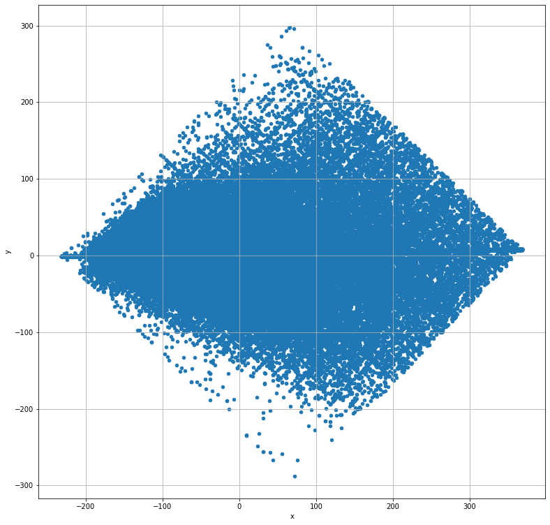
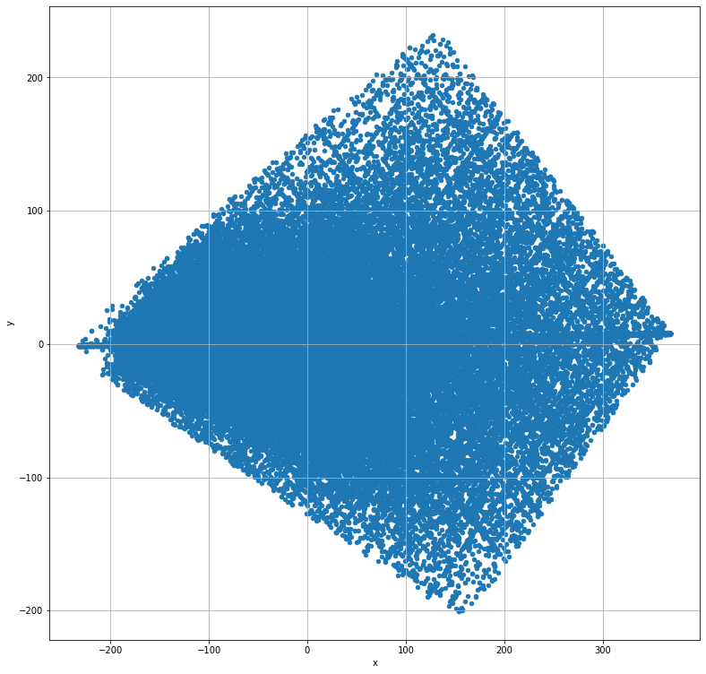
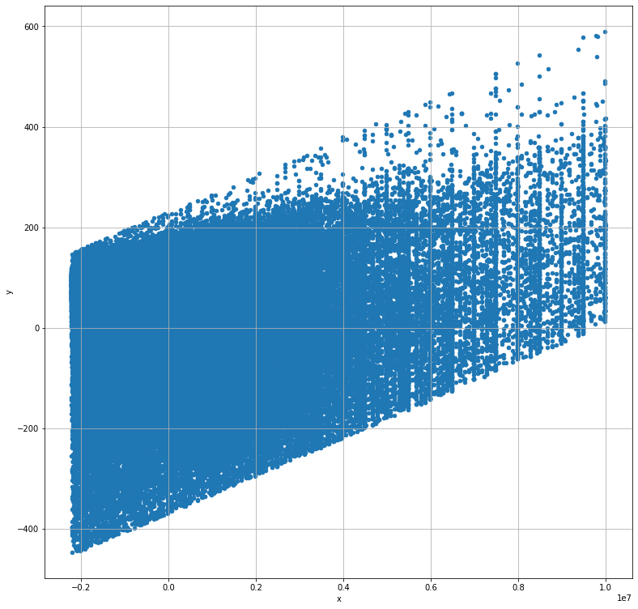
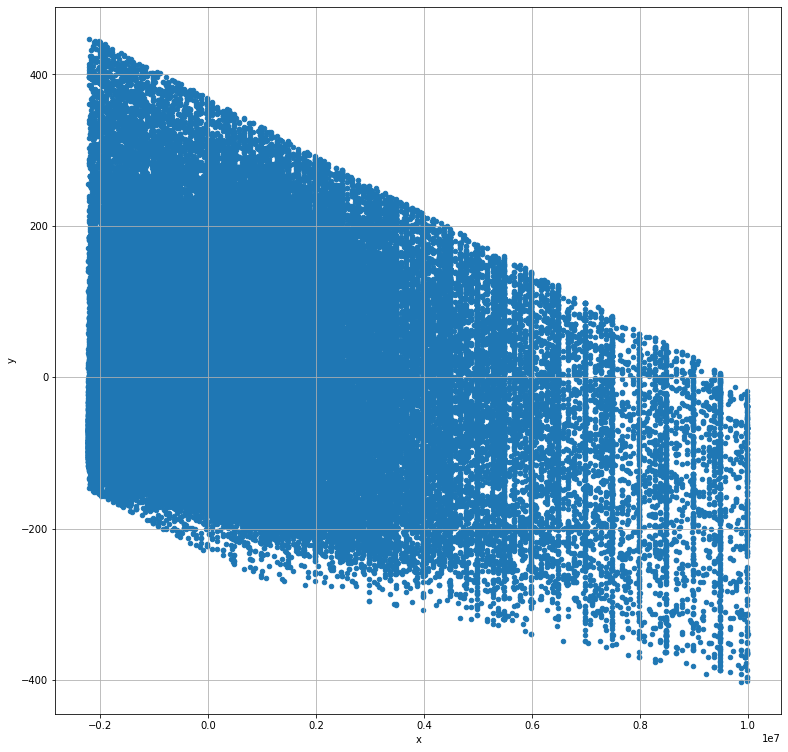
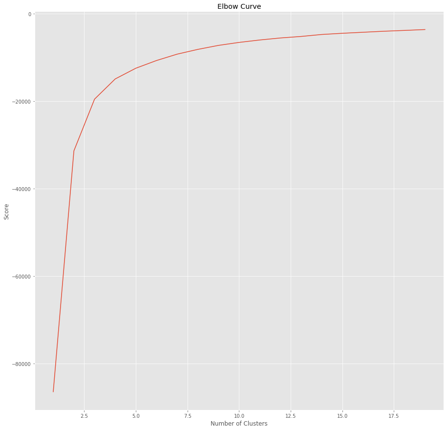
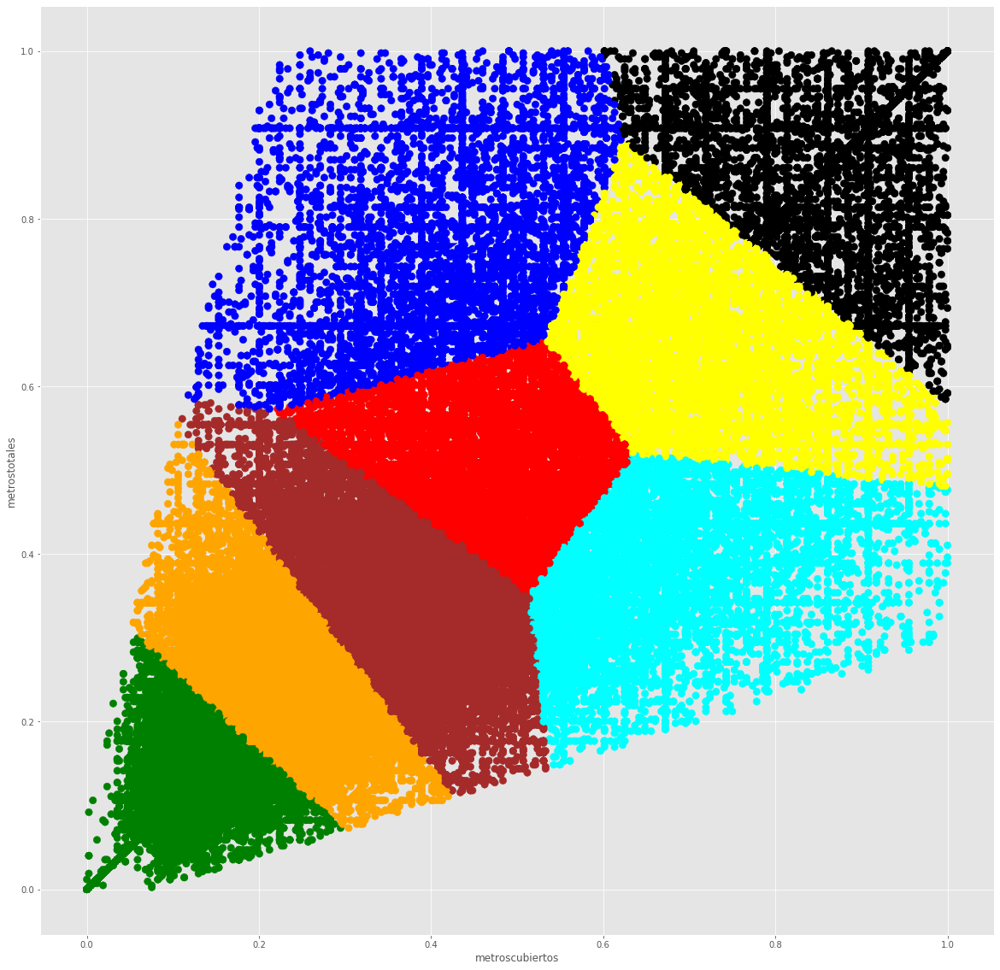

# Trabajo Práctico 2: Machine Learning

## Índice
- [Trabajo Práctico 2: Machine Learning](#trabajo-pr%c3%a1ctico-2-machine-learning)
  - [Índice](#%c3%8dndice)
  - [Introducción](#introducci%c3%b3n)
    - [Filtrado](#filtrado)
    - [PCA](#pca)
    - [Nulos](#nulos)
    - [Clustering(TSNE)](#clusteringtsne)
  - [Features](#features)
    - [Feature engineering](#feature-engineering)
      - [Independientes del precio](#independientes-del-precio)
      - [Dependientes del precio](#dependientes-del-precio)
      - [En relación a los textos](#en-relaci%c3%b3n-a-los-textos)
      - [Distancias](#distancias)
      - [One Hot Encoding](#one-hot-encoding)
      - [KD trees](#kd-trees)
      - [Rankings](#rankings)
      - [Intervalos](#intervalos)
  - [Falta todas las features de lofano](#falta-todas-las-features-de-lofano)
  - [Mapa de correlación para ver que es lo mas importante](#mapa-de-correlaci%c3%b3n-para-ver-que-es-lo-mas-importante)
    - [Feature Selection](#feature-selection)
      - [SelectKBest](#selectkbest)
      - [SelectFromModel](#selectfrommodel)
      - [Recursive Feature Elimination (RFE)](#recursive-feature-elimination-rfe)
      - [Recursive Feature Elimination w/ Cross Validation (RFECV)](#recursive-feature-elimination-w-cross-validation-rfecv)
      - [Modelos de Machine Learning](#modelos-de-machine-learning)
      - [Shap](#shap)
  - [Modelos](#modelos)
    - [XGBoost](#xgboost)
    - [LightGBM](#lightgbm)
    - [Catboosting](#catboosting)
    - [Random Forest](#random-forest)
    - [Extra Randomized Tree](#extra-randomized-tree)
    - [Redes neuronales](#redes-neuronales)
      - [Keras](#keras)
      - [MLPRegression](#mlpregression)
    - [Clustering](#clustering)
  - [Parameter tuning](#parameter-tuning)
    - [Hyperopt](#hyperopt)
    - [Random Search](#random-search)
    - [Grid Search](#grid-search)
  - [Ensambles](#ensambles)
    - [Stacking](#stacking)
    - [Blending](#blending)
  - [Resultados obtenidos](#resultados-obtenidos)
  - [Conclusiones](#conclusiones)

## Introducción

El objetivo principal del trabajo es  determinar, para cada propiedad presentada, cuál es su valor de mercado.
La realización del trabajo se hace con algoritmos de Machine Learning, una disciplina que busca poder generar clasificaciones en base a un entrenamiento sobre información pasada, seguida de una validación de las predicciones generadas. En el trabajo se prueban distintos algoritmos, los cuales todos en distinta manera hacen uso de los datos. Es por esto que es muy importante saber qué datos usar, y buscar cómo codificarlos de tal forma que mejor se aprovechen.

El primer paso del trabajo consistió en realizar una breve investigación sobre lo ya hecho en el trabajo anterior. En el primer trabajo práctico de la materia se realizó un análisis exploratorio de datos de la Zona Prop. Si bien no son exactamente los mismos datos que los trabajados acá, son de la misma índole.

### Filtrado

La detección de anomalias (outliers) implica el econocimiento y corrección o eliminación de datos erróneos, un dato anómalo es aquel que tiene valores imposibles para uno o mas de sus atributos. Por lo que en una primera instancia se decide, filtrar aquellos registros que semanticamente son posible pero no tiene sentido en el
contexto de los demás datos, es decir que probablemente se trate de un dato mal ingresado.
En las Figuras I-IV se pueden observar los recortes realizados.

### PCA

Se utilizo PCA en un intento de manipular la dimensionalidad de los datos. La idea de PCA es encontrar las ”direcciones” principales de los datos, es decir, aquellas direcciones sobre las cuales podemos proyectar los datos reteniendo su variabilidad.
Sin embargo, en un intento de reducir el ruido
del set de datos, los resutados no fueron buenos ya que _overfiteaban_.

### Nulos

Algunos algoritmos admiten datos incompletos y otros no. En los casos en los que los datos incompletos no son admisibles, por lo tanto debemos solucionarlos de alguna forma.

El proceso de imputación de valores faltantes puede hacerse de muchas formas, una forma muy simple es completar con el valor promedio para atributos numéricos y con el valor mas popular para atributos categóricos. Esto se realiza tanto con las habitaciones, garages, baños y antiguedad.

Por un otro, se puede ver que para toda propiedad con valor nulo en los metros totales, tiene valor en los metros cubiertos y viseversa. Por lo que se decide completar con este mismo.

Se completan los id zonas faltantes con un promedio de los ids para aquellas propiedades que comparten ciudades y en su defecto que comparten provincia. Y algo similar se realiza al momento de completar la longitud y latitud, verificando que el promedio se encuentre dentro del mapa.

### Clustering(TSNE)

Con la intención de ver si se encontraban clusters que agrupen a las propiedades, se utilizó el algoritmo T-SNE, que es el estado del arte para la representación de datos en dos dimensiones.

## Features

### Feature engineering

Con lo investigado del previo trabajo y todos los dataframes generados, se busca todo tipo de atributos de los usuarios, para que luego puedan ser seleccionados y aprovechados por los algoritmos a aplicar.

Primero se separan las features según su dependencia con el precio de la propiedad:

#### Independientes del precio

- **Metros Totales y Cubiertos**

  - *metrostotales_log, metroscubiertos_log*: Escala logaritmica de los metros totales y cubiertos.
  - *porcentaje_metros*: Metros cubiertos sobre metros totales.
  - *diferencia_metros*: La diferencia entre los metros totales y cubiertos.
  - *intervalo_metros_totales, intervalo_metros_cubiertos*: Se agrupan en 5 intervalos dependiendo del tamaño de la propiedad.
  - *metros_totales_normalizados, metros_cubiertos_normalizados*: Los metros totales y cubiertos normalizados.
  
- **Por tipo de propiedad**

  - *escomercial*: Booleano que indica si la propiedad es del tipo comercial(Bodega comercial, centro comercial, etc.) o no(Casa, apartamento, etc.).
  - *tipo_propiedad_compartida*:  Booleano que indica si la propiedad es compartida(Casa en condominio, Duplex, etc.) o no(Casa, apartamento, etc.).
  - *promedio_metros_tipo_propiedad, promedio_metros_cub_tipo_propiedad*: el promedio de metros que tiene cada tipo de propiedad.
  - *prop_frecuente*: Aquellas propiedades que aparecen en el mercado mayor cantidad de veces.

- **Por ubicación**

  - *zona*: Divición del mapa por Norte, Centro o Sur.
  - *top_provincia*: Ranking de provincias ordenadas de las mas caras a las menos(No depende del precio especificamente, solo se basa en los datos encontrados en el primer trabajo práctico).
  - *es_ciudad_centrica*: Booleano que indica si la ciudad es la más poblada de la provincia(Ej: en Distrito Federal,Benito Juárez).
  - *promedio_metros_totales_provincia, promedio_metros_cubiertos_provincia*: el promedio de metros que tiene cada provincia.

- **Por fecha**

  - *anio,mes,dia*: Separo del feature fecha en día, mes y año.
  - *trimestre*: Indico en que trimestre del año pertenece la propiedad.
  - *dias_desde_datos, meses_desde_datos*: Distancias entre las diferentes publicaciones.

- **Propiedades booleanas**

  - *escuelas_centros_cercanos*: Verifica si tiene escuelas cercanas, centros comerciales cercanos, ambos o ninguno.
  - *delincuencia*: Booleando indicando si es una ciudad con alta tasa de delincuencia.
  - *turismo*: Booleano indicando si es una ciudad considerada turística.
   - *es_lujoso*: Booleano que determina si una propiedad es lujosa o no, esto se verifica si la propiedad cuenta con piscina, usos multiples y gimnasio.
  - *es_capital*: Booleano que indica si es la capital federal del país o no lo es.

- **Por cantidad de habitaciones, garages y baños**

  - *cantidad_inquilinos*: Promedio aproximado de personas que viven en la propiedad según la cantidad de  habitaciones, garages y baños.
  - *tam_ambientes*: Los metros cubiertos dividido la cantidad de habitaciones y baños.

- **Antiguedad**

  - *es_antigua*: Booleando que indica si la propiedad tiene más de 30 de antiguedad, indicando si es o no antigua.
  - *habitaciones_antiguedad*: El promedio de habitaciones según la cantidad de años de la propiedad.

#### Dependientes del precio

- **Por ubicación**

  - *promedio_precio_provincia, promedio_provincia_log*: Agrupo por provincia y calculo el promedio del precio de cada una. Se genera un feature con el promedio normal y otro con una escala logaritmica.
  - *promedio_precio_ciudad, promedio_ciudad_log*: Idem para cada una de las ciudades de México.
  - *promedio_precio_ciudad_gen*: Se generaliza el feature.
  - *varianza_precio_ciudad*: Agrupo por ciudades y calculo la varianza del precio.
  - *count_ciudad*: Agrupo por ciudades y calculo la cantidad de propiedades que hay en esta.
  - *promedio_id_zona, promedio_id_zona_log, promedio_id_zona_gen, varianza_id_zona count_id_zona*: Idem provincia y ciudades.

- **Por tipo de propiedad**

  - *promedio_precio_tipo_propiedad*: Agrupo por tipo de propiedad y le asigno el promedio del precio.
  - *promedio_precio_tipo_propiedad_ciudad*,  promedio_precio_tipo_propiedad_ciudad_gen: Agrupo tanto por el tipo de propiedad como para la ciudad a la que pertence y le asigno el precio promedio.
  - *count_tipo_propiedad*: Agrupo por tipo de propiedad y calculo la cantidad de propiedades de ese mismo tipo hay.
  - *count_tipo_propiedad_ciudad*:  Agrupo por tipo de propiedad  y ciudad y calculo la cantidad de propiedades de ese mismo tipo hay en cada ciudad.

- **Por fecha**

  - *promedio_por_mes*: Se calcula el promedio de precios por cada mes del año.
  - *varianza_por_mes*:  Se calcula la varianza de precios por cada mes del año.

- **Por cantidad de habitaciones, garages y baños**

  - *promedio_precio_habitaciones*: Agrupo por cantidad de habitaciones y calculo el precio promedio.
  - *promedio_precio_banos_garages*: Idem pero agrupo por cantidad de baños y garages.
  - *promedio_precio_habitaciones_banos_garages*: Idem pero agrupo por cantidad de habitaciones, garages y baños.
  - *promedio_precio_hbg_tipo_propiedad*: Idem pero agrupo también por tipo de propiedad.
  - *promedio_precio_hbg_tipo_propiedad_provincia*: Idem pero también agrupo por provincia.
  - *promedio_precio_hbg_tipo_propiedad_provincia_gen*: Generalizo el último feature.
  
- **Por propiedades booleanas**

  - *promedio_precio_booleanos*: Agrupo por las propiedades booleanas(si tiene o no piscina, gimnasio y usos multiples) y calculo el precio promedio.

- **Por puntajes(Insight)**

  - *puntaje*: A partir de lo aprendido en el Trabajo Práctico I, se realizo un importante aporte a Navent donde calificabamos cada una de las propiedades con el objetivo de poder encontrar el 'precio ideal' para todas. Por ende teniendo en cuenta: la piscina, gimnasio, usos multiples, cantidad de baños, habitaciones, garages, metros totales, cubiertos y provincia se van a rankear todas las propiedades.

#### En relación a los textos

- *idf_titulo, idf_descripcion*: La idea de TF-IDF es darle a cada término un peso que sea inversamente proporcional a su frecuencia. Los términos que aparecen en muchas propiedades serán entonces menos importantes que los términos que solo aparecen en unos pocos.El IDF de un término se calcula de la forma: $IDF(t_i) = log(\frac{N + 1}{f_(t_i))}$ Donde N es la cantidad de documentos y $f_(t_i)$ es la cantidad de registros en los que aparece el término. Y TF es el term frequency. Se calculan tanto para el título, como para la descripción de cada propiedad.

- *peso_titulo, peso_descripcion*: Un contador de palabras importantes en el título y la descripción.

#### Distancias

- *distancia_ciudad_centrica*: Con la distancia Euclediana se encuentra la distancia entre la propiedad con la ciudad más importante de la Erovincia.
es un conjunto de árboles de decisión en donde cada árbol usa un bootstrap del set de entrenamiento y un cierto conjunto de atributos tomados al azar.

- *distancia_centro_mexico*: Con la distancia Euclediana se encuentra la distancia entre la propiedad y en centro de México: Distrito Federal.

- *distancia_ciudad_costosa*: A partir de las ciudades con mayores promedios en precio de cada provincia, se calcula la distancia entre cada propiedad y la misma.

#### One Hot Encoding

Consiste en dividir el atributo en tantas columnas como valores posibles puede tener y usar cada columna como un dato binario indicando si el atributo toma o no dicho valor. Por lo que esta idea se repite para todos los features categóricos: provincia, tipodepropiedad, zona, etc.

#### KD trees

Sklearn nos probee de _neighbors_, funcionanlidad que resuelve el problema de los vecinos más cercanos. 
Este algoritmo consiste en encontrar los vecinos más cercanos del punto a clasificar, y luego simplemente predecir que el punto en cuestión es de la clase del cual la mayoría de sus vecinos sean parte.
Se elige este algoritmo debido a que un enfoque con fuerza bruta cuenta con una complejidad algorítmica muy alta, KD Tree trabaja con una estructura muy eficiente ya que si el punto A es lejano del punto B y B es cercano a C, entonces logra darse cuenta que A y C son puntos lejanos sin tener que calcular sus distancias.

###TODO DIAGRAMA KDTREE

#### Rankings

Siguiendo la idea del Insight realizada en el Trabajo Practico I, se realizaron diferentes rankings según las caracteristicas de la propiedad:

- *ranking_en_provincia, ranking_en_ciudad*: Organiza las provincias dejando como primer puesto a aquella provincia/ciduad con precio más elevado.
- *ranking_en_provincia_tipodepropiedad_precio,  ranking_en_provincia_tipodepropiedad_cantidad,  ranking_en_provincia_ciudad_precio, ranking_en_provincia_ciudad_cantidad*: El ranking se basa en dos atributos, va a depender de su provincia y del tipo de propiedad, o de la provincia y la ciudad. Ademas se realizan dos tipos de ranking: uno basado en sus precios y el otro en 'popularidad', es decir la cantidad de propiedades que cuentan con esas características.
- *ranking_en_provincia_intervalo_metros_totales_precio ,  ranking_en_provincia_intervalo_metros_totales_cantidad , ranking_en_provincia_intervalo_metros_cubiertos_precio ,  ranking_en_provincia_intervalo_metros_cubiertos_cantidad ,  ranking_en_tipodepropiedad_intervalo_metros_totales_precio ,  ranking_en_tipodepropiedad_intervalo_metros_totales_cantidad ,  ranking_en_tipodepropiedad_intervalo_metros_cubiertos_precio,  ranking_en_tipodepropiedad_intervalo_metros_cubiertos_cantidad*: En una primera instancia se generan intervalos(en cuanto a los percentiles) tanto para los metros totales, como los cubiertos. Una vez separados según su tamaño, estos son agrupados con provincia y con tipo de propiedad y se genera un ranking que dependa de ambos atributos.
- *ranking_en_provincia_intervalo_distancia_ciudad_cara_precio,  ranking_en_provincia_intervalo_distancia_ciudad_cara_cantidad*: Nuevamente es necesario generar intervalos entre todas las distancias encontradas a partir de los percentiles. Se toman esos intervalos y se agrupan junto con la provincia perteneciente a cada uno de las propiedades y con ello generar el ranking.

#### Intervalos

A continuación enumeramos todos los nuevos features que fueron divididos tanto por intevalos **uniformes**, como por intervalos que dependen de sus **percentiles**. Se cuenta con una función genérica que permite generar n intervalos según la conveniencia. Para el trabajo, se eligieron 12 intervalos para cada feature, ya que con un número más elevado podríamos correr el riesgo de overfitear los resultados.
 
- *antiguedad_bins_unif, antiguedad_bins_perc*
- *ditancia_centro_bins_unif, ditancia_centro_bins_perc*
- *distancia_centro_mexico_bins_unif , distancia_centro_mexico_bins_perc*
- *distancia_ciudad_cara_bins_unif , distancia_ciudad_cara_bins_perc*
- *promedio_id_zona_bins_unif, promedio_id_zona_bins_perc*
- *promedio_precio_hbg_tipo_propiedad_provincia_bins_unif ,  promedio_precio_hbg_tipo_propiedad_provincia_bins_perc*
- *promedio_precio_tipo_propiedad_ciudad_bins_unif ,  promedio_precio_tipo_propiedad_ciudad_bins_perc*
- *promedio_precio_hbg_tipo_propiedad_provincia_bins_unif ,   promedio_precio_hbg_tipo_propiedad_provincia_bins_perc*
- *tam_ambientes_bins_unif, tam_ambientes_bins_perc*
- *metrostotales_bins_unif, metrostotales_bins_perc*
- *metroscubiertos_bins_unif, metroscubiertos_bins_perc*

## Falta todas las features de lofano

## Mapa de correlación para ver que es lo mas importante

A continuación se presenta un mapa de correlación con algunos de los features que presentan mayor relación con el precio(FIgutra V). Como se puede observar, no todos los features cuentan con el mismo _peso_, se podría decir que algunos son mas importantes que otros a la hora de predecir los precios de las propiedad. Es por eso que en la siguente sección nos concentramos en la selección de los mismos con el fin de entrenar los modelos solamente con los mejores.

### Feature Selection

Una vez que se tienen todos los atributos en un mismo dataframe y luego de un par de pruebas se ve que no siempre hay que entrenar los modelos con la totalidad del dataframe. Viendo que para algunos algoritmos el orden y la
selección de los features logrababa distintos resultados, se busca la forma de encontrar la combinación óptima de features y eliminar todo el ruido posible.

#### SelectKBest

Elige los mejores features tomando los k que cuenten con mayor correlación con el precio.

#### SelectFromModel

Este método es muy similar a SelectKBest, entrena un modelo y devuelve los k features con mayor relevancia pero aquí se va a condicionar por el puntaje que le dio el modelo. Es importante que el modelo tiene que ser compatible con la API de sklearn.

#### Recursive Feature Elimination (RFE)

RFE fue la herramienta que nos dejo los mejores resultados. Se trata de un metodo que va eliminando aquellos features que sean debiles hasta quedarse con la cantidad establecida. Para ello, rankea todos los features y a través de una eliminación recursiva obtengo el resultado final.

#### Recursive Feature Elimination w/ Cross Validation (RFECV)

Selecciona los mejores subsets de features usando RFE, y se queda con el mejor de ellos basandose en el puntaje obtenido con cross-validation.

#### Modelos de Machine Learning

(usamos varios modelos para ver el ranking de los features, por ejemplo rnadom forest)

#### Shap

Shap es una herramienta que nos permite evaluar cuanto cambia el modelo a partir del valor de cada uno de los features. Es decir que, estima cuanto aumenta o disminuye la importancia de un feature a la predicción final. Esto, a la vez, permite que sea posible la visualización de un feature que hace mucho ruido, en otras palabras nos alerta cuando un feature no tiene consistencia en cuánto suman o restan considerando su valor.

**graficos*

## Modelos

### XGBoost

XGBoost es un algoritmo muy eficiente de gradient boosting en árboles. A diferencia de otros modelos de gradient boosting utilizados, este no puede utilizar features categoricos, solamente acepta numericas. Por ende fue necesario generar los features de forma manual,ya sea con one hot encoding. mean encoding, etc.
Con el objetivo de evitar el overfiteo fue importante considerar el valor de los hiperparametros de learning_rate, max_depth y min_child_weight. Al ser un modelo que tiene un tiempo de ejecucion tanto para el entrenamiento como para la predicción alto, se tomaron en cuenta diferentes hiperparametros para controlar la velocidad: colsample_bytree, subsample y n_estimators.

### LightGBM

LightGBM es simplemente el algoritmo que constantemente mejores resultados nos dio. Este algoritmo de gradient boosting sobre árboles se diferencia de XGBoost en que construye los árboles según las hojas, y no los niveles. Es
importante que sus híper-parámetros estén bien configurados (por ejemplo, la profundidad máxima de los árboles), para que rápidamente se encuentran muy buenos saltos de calidad en el modelo. Algunos de los hiperparametros mas importantes buscados que se encargaron de controlar el overfiteo fueron: learning_rate, max_depth, min_data_in_leaf y num_leaves. Por otro lado, tambien se tuvieron en cuenta hiperparametros que facilitaran el contro de la velocidad del modelo, tales como bagging_fraction o num_iterations.
Este algoritmo también se destaca por ser rápido y consumir poca memoria. También, tiene un gran manejo de la  dimensionalidad de los datos, sin cambiar mucho frente a ellos.

### Catboosting

Una propiedad a favor de este modelo es que acepta las variables categoricas. A diferencia de otros modelos como LightGBM que no acpeta cateogircos, por ende la conversión es ranking_en_tipodepropiedad_intervalo_metros_cubiertosmanual por parte de los usuarios. Sin embargo cuenta con una gran contra que es que no acepta features del tipo float. Con el objetivo de no dejar de lado los features importantes, se decidió multiplicar por un valor elevado constante y convertir en integer.
Este modelo de _gradient boosting_, entrena y predice de forma bastante rápida.
Se buscaron los mejores hiperametros para learning_rate, depth y l2-leaf-reg con la idea de evitar el overfiteo. Además se repitió este proceso para iterations para poder controlar el tiempo del mismo.

### Random Forest

Es un conjunto de árboles de decisión en donde cada
árbol usa un bootstrap del set de entrenamiento y un cierto conjunto de atributos tomados al azar. Es una
aplicación directa de bagging a árboles de decisión pero con una diferencia, cada árbol no usa el total de atributos sino un subset de los mismos.
El modelo produjo buenos resultados para la mayoría de los
sets de datos, esto se debe a su habilidad para evitar overfitting.

### Extra Randomized Tree

Teniendo en cuenta que los resultados de Random Forest fueron muy buenos, se utilizo un modelo bastante similar ya que ambos modelos son un ensamble de un arbol individual. Se presentan dos diferencias fundamentales: En este nuevo modelo, cada arbol es entrenado con todo el set de entrenamiento, por otro lado, el 'split' es completamente random. A partir de todos los cortes generados, nos vamos a quedar con aquel que cuente con el mayor score.
Los resultados obtenidos con este método, son levemente peores que Random Forest, sin embargo vale la pena considerarlo.

### Redes neuronales

#### Keras

Se planteo una red neuronal sencilla que define un procedimiento que nos devuelve una red neuronal. Con la instruccion Dense, se añade una capa oculta(hidden layer) de la red, en cada una de las instrucciones se definien la cantidad de nodos, la función de activación para las capas(En las capas ocultas ReLu y para la capa de salida linear).
Para obtener buenos resultados fue necesario normalizar todos los features previamente al entrenamiento. Con ello obtenemos que el set comprenderá valores de entre 0 y 1. Con esto el entrenamiento suele aportar mejores resultados.

#### MLPRegression

### Clustering
Clustering es una técnica de entrenamiento no supervisado, es decir que se va a trabajar con las propiedades del DataFrame, sin tener un tipo de salida esperado. La ídea principal es agrupar aquellos ítems similares dentro del mismo grupo. Particularmente, en este trabajo práctico se realizaron varias asociaciones de datos, teniendo en cuenta distintos conjuntos de features para cada una de ellas. 
En particular, se utilizó *kmeas* como método de agrupamiento, el cual tiene como principal hiperparámetro la cantidad de clusters entre los cuales se pretende dividir los datos. Como en el resto del trabajo práctico, elegir buenos hiperparámetros es esencial maxificar los resultados de las predicciones, por lo cual se procedio a graficar en cada caso el score vs la cantidad de cluster. A modo de ejemplo, se muestra el esquema correspondiente a los features: *metrostotales*, *metroscubiertos*, *metrostotales_log*, *metroscubiertos_log*, *porcentaje_metros*, *diferencia_metros*, *intervalo_metros_totales*, 
*intervalo_metros_cubiertos*, *metroscubiertos_bins_unif* y *metroscubiertos_bins_perc*.

Dado el gráfico se puede observar que a partir de *6* empieza a ser menos relevante lo que se pierde comparado en lo ganado. De está manera se obtuvo el número de clusters con los cuales trabajar para los anteriormente mencionados features. 
Para obtener una representación visual de como quedaron separadas las propiedades, y a modo de ejemplo, en el siguiente gráfico se muestra la proyección en dos dimensiones de las columnas: *metros totales* y *metros cubiertos*, donde el color de cada punto indica a que cluster pertenece.

El label asociado a cada cluster es lo que se usará a modo de feature en los algoritmos de regresión.

## Parameter tuning

En los primeros modelos corridos fue cuando se empezo a notar lo que ya se sabía: los híper-parámetros son muy importantes y puede marcar la diferencia entre un buen modelo y uno promedio o incluso malo.
Inicialmente, debido a la gran cantidad de opciones para algunos algoritmos, optamos por utilizar hyperopt, random search y grid search.

### Hyperopt

En primera instancia se utilizo Hyperopt para hallar los mejores hiperparametros de cada uno de los modelos debido a que es una API bastante simple y fácil de utilizar. Se podría describir como una RandomSearch *guiado*, ya que la misma API puede dar cuenta de cuando es necesario modificar los resultados, es decir que, trabaja tomando muestras al azar y logra entender que combinaciones probar y cuales no.
Este método permite usar distintos y amplios set de opciones(hp.choice, hp.randit, hp.quniform, hp.qloguniform,hp.normal, hp.uniform, hp.lognormal, etc.) lo cual facilita la busqueda automatizada para las distintas combinaciones de hiperparametros.
Los resultados a partir del uso de Hyperopt fueron en su mayoría buenos, sin embargo el tiempo de ejecución no es de lo mejor.

### Random Search

Este módelo cuenta con varias diferencias importantes con hyperot. La principal ventaja es que usa Cross-Validation, de esta forma se puede asegurar que los hiperparametros no overfiteen el modelo. Es una técnica utilizada para evaluar los resultados de un ánalisis y garantizar que sean independientes de la partición entre datos de entrenamiento y prueba. Consiste en repetir los calculos sobre las diferentes particiones.

En cuanto a las deventajas: por un lado, a diferencia de hyperopt, no permite un rango continuo de valores, es necesario establecer un arreglo con valores discretos. Y aún así, el modelo es más costoso, ya que va a evaluar cada combinación de hiperparametros k veces por cada k fold (con el beneficio de asegurarse que no overfiteen hacia un resultado)

### Grid Search

Se importa GridSearchCV de la librería de sklearn. Es importante tener en cuenta que es extremadamente costoso este método ya que prueba todas las combinaciones posibles para cada una de las opciones que le designamos.
Para evitar esto, se toman los resultados obtenidos en hyperopt o RandomSearch con el objetivo de acotar los valores y a partir de ellos poder trabajar con Grid Search. No deja de ser un modelo extremadamente costoso pero de esta manera se reduce en un gran porcentaje el tiempo de ejecución y se logra encontrar valores óptimos.

## Ensambles

Los mejores algoritmos de Machine Learning suelen surgir de la combinación de varios algoritmos. A continuación se detallan diferentes ensables que se tuvieron en cuenta en el trabajo práctico:

### Stacking

Se utilizo una API llamada vecstack para implementar el ensable, conventiente para la automatización OOF(out of fold), predicción y bagging de cualquie cantidad de modelos. Es decir que es utilizado para combinar diferentes algoritmos de machine learning, con el uso de k-fold validation de esta forma nos aseguramos de que no se overfitee a un resultado agrupando de a k intervalos.
Por cada tipo de algoritmo se realizan k fracciones del dataset, se realizan las predicciones de los modelos y luego se calcula un promedio de los k resultados. Este promedio de las predicciones será una nueva feature del modelo. Este proceso de repite para todos los modelos que serán ensamblados.
Una vez que me encuentro con todos los features nuevos, existen varios caminos para continuar. Por un lado, la idea mas sencilla sería realizar simplemente un promedio de todos los valores(avarege), lo cual genero muy buenos resultados. Por el otro lado , se puede utilizar un modelo para nuevamente realizar predicciones con las nuevas features. Se tomo primero unicamente las nuevas features generadas y se probo con LightGBM, luego se repitió la idea pero esta vez utilizamos todas las features y se añadieron las recientemente generadas.

Los resultados obtenidos con este ensambles fueron muy buenos, y esto se debe a la técnica de OOF que asegura que no se overfitee en el resultado final. En contraparte, debido al uso de muchos modelos, el tiempo de ejecución es de los peores. En conclusión es mayor el beneficio que nos trae, que el costo así que es considerado de los mejores modelos.

### Blending

## Resultados obtenidos

## Conclusiones
